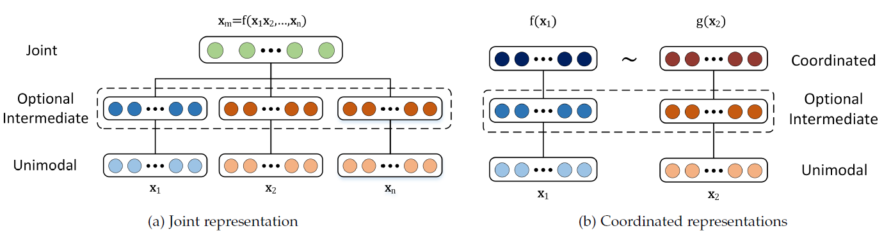
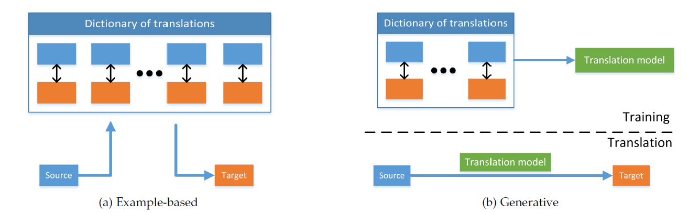
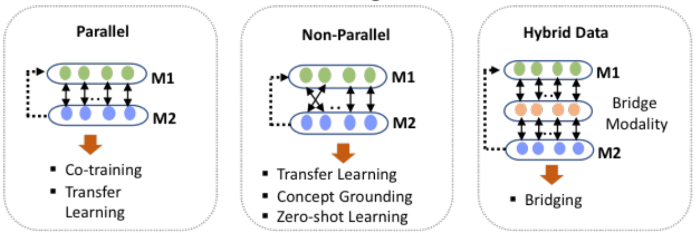

> [Multimodal Machine Learning: A Survey and Taxonomy](https://arxiv.org/pdf/1705.09406.pdf) TPAMI 2018

## 核心挑战

- **Representation**：如何学习不同模态的数据表示
- **Translation**：如何将数据从一种模态映射到另一种模态
- **Alignment**：如何对齐不同模态的数据元素
- **Fusion**：如何结合不同模态的数据来完成任务
- **Co-learning**：如何利用其他模态的知识来辅助主模态的学习

#### 注意，上述不同挑战并不是相互独立的，而是有重叠，并且相辅相成的

---

### Multimodal Representation

- **Joint Representation**：将不同模态的信号结合为一个表征
  - 深度神经网络：
    - 优势：性能强大；有无监督预训练的能力
    - 劣势：不能自然地处理某个模态的数据缺失
  - 深度玻尔兹曼机：
    - 优势：无监督训练；可以自然处理某个模态的数据缺失
    - 劣势：难以训练；计算成本高；要使用近似变分方法来训练
- **Coordinated Representation**：每个模态都有各自的表征，但不同模态之间有特定的相似度约束
  - Similarity Models：最小化不同模态的表征的距离
  - Structured Coordinated Space Models：除了表征相似度之外的其他约束
    - cross-modal hashing：将高维表征转为二进制码，然后最小化二进制码的距离
    - order embedding：相似度有顺序概念，sim(a, b1) > sim(a, b2) > sim(a, b3) > ...
    - canonical correlation analysis: 约束不同模态的表征满足某种相关性（如因果关系）

---

### Multimodal Translation

- **Example-based**：基于一个词典（包含很多Source-Target Pairs），通过检索来完成翻译
  - Retrieval-based models：一对一检索
    - unimodal retrieval：在source空间中检索，返回检索结果所对应的target
      - 优势：只需要学习单模态表征
      - 劣势：只能单向翻译；需要对检索结果进行额外的处理，例如重排序
    - crossmodal retrieval：将source和target投影到相同空间，以直接使用source来检索target
      - 优势：允许双向翻译
      - 劣势：需要非常大型的词典用于训练
  - Combination-based models: 一对多检索，再合并为新target
    - 优势：可以生成词典中不存在的target
    - 劣势：只能单向翻译
- **Generative**：使用词典来训练生成式模型，以直接生成翻译结果
  - grammar-based：使用预定义的模板和语法来生成固定格式的target
    - 优势：可以生成句法和语法正确的target
    - 劣势：只能公式化地生成，而不能创造；需要设计复杂的概念识别pipeline，
  - encoder-decoder：将source编码为隐变量，再解码为target
    - 优势：性能强大，已经成为多模态生成模型的主要范式
    - 劣势：需要大量的训练样本；神经网络可能只是单纯地记忆训练数据，而没有真正理解和创造
  - continuous generation：连续流生成模型，根据source的当前输入流，实时在线生成target输出流
    - 需要处理不同模态之间的时序一致性，适用于时序信号到时序信号的翻译
    - 早期工作大多使用概率图模型，目前大多数已被encoder-decoder代替

---

### Multimodal Alignment

- **Explicit**：任务目标是显式地对齐不同模态的元素（例如：视频帧和菜谱步骤的对齐）
  
  - unsupervised：不需要每个元素的对齐标签
    - DTW
    - 图模型
  - (weak) supervised：需要每个元素的对齐标签
    - 深度神经网络

- **Implicit**：把元素对齐作为其他任务的中间步骤，而不是任务目标（例如跨模态检索时，加入region和phrase的匹配模块）
  
  - 图模型：需要人工构造不同模态的元素对应关系
  - 注意力机制：不是以整条样本为基本单元，直接编码得到表征（这需要大型的编码器）；而是以元素作为基本单元，以元素的加权求和作为样本表征

- **难点**：
  
  1. 显式对齐的有监督数据集非常稀缺
  2. 不同模态的元素相似度指标难以设计
  3. 并不是一种模态中的所有元素能对应到另一种模态

---

### Multimodal Fusion

- **Model-agnostic**
  - early fusion：对各模态的特征进行合并（**特征层**）
    - 只需要训练一个预测器，流程简单
  - late fusion：对各模态的决策（分类或回归）结果进行合并（**决策层**）
    - 每个模态都有自己的预测器，更加灵活
    - 能直接应用于多模态数据缺失的场景
    - 没有并行的多模态数据也可以训练
  - hybrid fusion：二者兼并
- **Model-based**
  - 多核学习算法：每个模态设置一个核函数
    - 优势：Loss Function是凸函数，可以使用标准优化算法求出最优解
    - 劣势：核方法需要在测试时存储训练数据，并且测试样本要和所有存储数据计算核函数，推理速度慢，占用内存大（高维边界$w=\sum \alpha_i \phi(x_i)$，为了表示$w$，需要保存模型参数$\alpha_i$和训练样本$x_i$. 对于测试样本$x$，要计算$wx=\sum \alpha_i \phi(x_i)\phi(x)=\sum \alpha_i  K(x_i, x)$）
  - 图模型
    - 可以很好地利用数据的时空信息，适合时序建模任务
    - 方便融入专家的先验知识
    - 可解释性强
  - 神经网络
    - 优势：
      - 对大数据的学习能力
      - 允许多模态表征模块和融合模块的端到端训练
      - 性能好
    - 劣势：
      - 可解释性差，无法得知哪些特征/模态起到了重要作用
      - 依赖于大规模的训练数据
        - **难点**：
  1. 不同模态的数据可能不是时序对齐的（例如一部分是连续信号，另一部分是离散信号）
  2. 很难建模不同模态的互补信息，而不仅仅是额外信息（额外信息是指，所提取的多模态信息并不是必须的，只是相对于单模态数据增加了一些外部信息，带来一点性能的提升）
  3. 每个模态的数据在不同时间点可能有不同类型和不同级别的噪声

---

### Multimodal Co-learning

利用（资源丰富的）副模态来帮助（资源稀缺）的主模态的学习。例如，主模态的数据稀缺或数据含噪等场景。副模态只在训练阶段使用，而不在测试阶段使用，因此成为co-learning。

- **Parallel-data**：不同模态的训练样本能一一对应（Strong Pair）
  - 协同训练：主要解决半监督问题。为不同模态都训练一个弱分类器，然后共同决策，自举地为无监督样本打标签
    - bootstrap方法会导致生成的标签有偏，从而导致过拟合
  - 迁移学习：将知识从副模态的表征传递到主模态的表征，从而加强主模态的表征学习，在测试时只需要主模态的数据
- **Non-parallel data**：不同模态的训练样本之间不是一一对应，但共享类别或概念空间（Weak Pair）
  - 迁移学习：由于类别空间相同，因此可以根据类别来构造pair，从而使用分类任务来学习Coordinated Representation
  - conceptual grounding：学习不同模态的表征之间的共同概念（隐式或显式）
    - 使用与任务相关的特定概念（例如图像任务中的视觉概念），才能有助于提高性能
  - zero shot learning（ZSL）：不需要显式地见过某个概念的任何样本，就可以识别这个概念
    - 单模态ZSL：根据目标的属性或组件来识别新概念
    - 多模态ZSL：根据副模态来识别主模态的新概念（因为不同模态数据的类别是重叠的，所以在类别重叠的样本上对齐之后，可以将只有副模态才有的类别推广到主模态）
- **Hybrid**：不同模态的训练样本，通过中介模态或数据集，可以一一对应
  - 中介模态：中介模态和M1协同学习任务A，同时和M2协同学习任务B，进而间接地连接M1和M2的表征
  - 中介数据集：主模态M1的数据匮乏，但M2的数据丰富，可以分别训练M1和M2的表征，然后使用同时包含M1和M2的中介数据集来协同训练，进而将M2的数据知识迁移到M1的学习中
