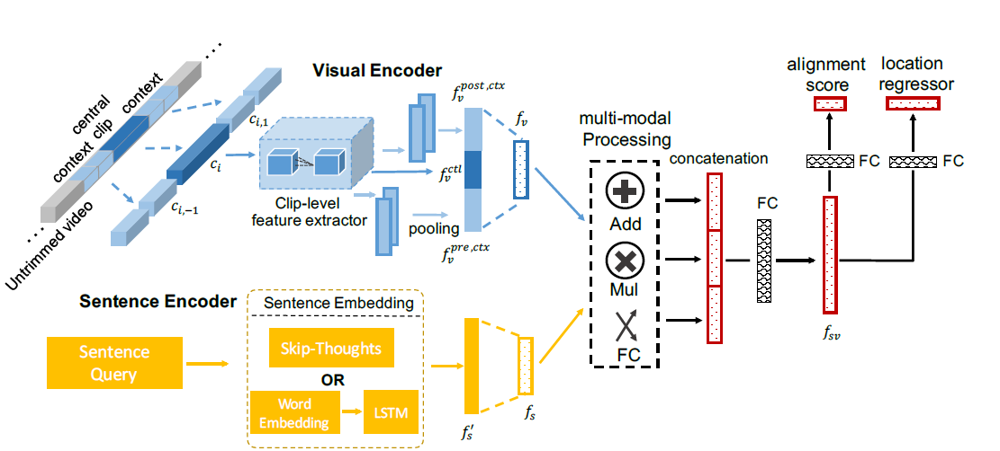

Highlight
===

1. 提出基于语言的时域动作定位任务    (Temporal Activity Localization via Language, TALL)
2. 提出一个跨模态时域定位预测模型，CTRL
3. 构建了两个适用于TALL的数据集 *TaCoS* 和 *Charades-STA*

Motivation
===

传统的**基于分类的的视频动作定位**受限于预定义的动作集合，无法涵盖到所有复杂的动作类型

- 直接使用自然语言来查询，不仅可以解决开集问题，还可以添加额外的约束（目标、属性、实体的关系）
  1. 将自然语言查询映射到离散标签空间，再与视频内容进行匹配
     - 会丢失查询语句中的许多细节信息
  2. 将图像特征和文本特征映射到同一个空间
     - 什么样的视觉特征适合检索
     - 如何更好地预测起止时间
  3. 密集采样不同尺度的滑动窗口
     - 不仅会增加计算代价，还会增加搜索空间导致更难对齐
  4. 借鉴目标定位的任务，通过学习锚框偏移量来调整时域框
     - 比目标定位更难，因为动作具有时空特性，会引入更多的背景噪声

Task
===

* 任务目标：给定一条句子描述和一段视频，输出该描述在视频中出现的一个或多个起止时间
* 数据集：每个视频有T帧和M个标签，每个标签包含一条句子和一对起止时间

Method
===

* **Visual Encoder**
  
  * 对每个视频，通过滑动窗口得到 $H$ 个片段
  * 以每个片段 $c_i$（central clip） 及其前后$n$个片段（context）作为输入
  * 独立提取每个片段的特征
  * 分别对前文和后文进行pooling，然后将前、中、后三者拼接，得到向量 $f_v$

* **Language Encoder**
  
  * 采用 LSTM 或 Skip-thought 将句子进行编码为一个向量 $f_s$

* **Multi-modal Processing Module**
  
  * $f_{sv} = (f_s \times f_v) || (f_s + f_v) || FC(f_s||f_v)$

* **Temporal Localization Regression Networks**
  
  1. 回归层：预测片段和句子的匹配分数
     
     - 对齐损失（NCE Loss）
       
       $$
       L_{aln}=\frac{1}{N}\sum_{i=0}^N \left[ \alpha_c \log \left(1+\exp \left(-c s_{i, i}\right)\right) +\sum_{j=0, j \neq i}^N \alpha_w \log \left(1+\exp \left(c s_{i, j} \right)\right)\right]
       $$
       
       $cs_{i,j}$表示第$i$个片段和第$j$条句子的匹配分数
  
  2. 回归层：预测时域锚框的偏移量
     
     - 参数化偏移：预测时域框的中心和长度的偏移量
       
       $$
       t_c=\left(p-p_c\right) / l_c
       $$
       
       $$
       t_l=\log \left(l / l_c\right)
       $$
       
        $p_c$和$l_c$为锚框的中心和长度，归一化和对数处理可以限制目标值，有利于预测和收敛
     
     - 非参数化偏移：直接预测时域框起止坐标的偏移量
       
       $$
       t_s = s - s_c
       $$
       
       $$
       t_e = e - e_c
       $$
       
         $s_c$和$e_c$表示锚框的起止坐标
     
     - 定位损失
       
       $$
       L_{reg}=\frac{1}{N} \sum_{i=0}^N\left[R\left(t_{x, i}^*-t_{x, i}\right)+R\left(t_{y, i}^*-t_{y, i}\right)\right]
       $$
       
       $x$和$y$表示参数化中的$p$和$l$，或非参数化中的$s$和$e$，$R$表示平滑$L_1$损失
     
     - 非参数化的实验结果更好，文中解释是：目标会随着视频尺寸的放缩而放缩，因此需要归一化；而动作的时间通常是固定的，不会因为视频长度的变化而变化，因此不需要归一化

* **Sampling Training Examples**
  
  * 通过下述条件，构造片段-句子对
    
    * $IoU > 0.5$ (视频片段与句子重叠的部分大于并集长度的50%)
    * $nIoL < 0.2$ (非重叠部分小于视频片段长的20%)
    * 一个片段只能分配一条句子
  
  * 使用$nIoL$的原因是，不能通过一昧地提高$IoU$的阈值来增加锚框和标签的重叠范围，因为
    
    1. 会导致正样本数量减少
    2. 会导致ground truth的偏移量过小，降低Locator的泛化性

Hard Cases
===

* 复杂长句的查询（**复杂长文本的建模问题**）
* 视频中包含相似动作但对象不同（**文本概念和视觉对象的对齐问题**）
  * 例如：put a *cucumber* on chopping board 和 put a *knife* on chopping board